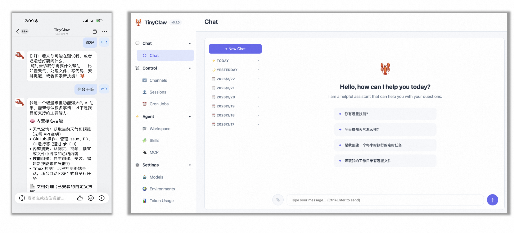

<div align="center">

# 🦞 TinyClaw

**Ultra-lightweight personal AI assistant** — A Java-based, one-stop AI Agent framework with multi-model, multi-channel and multi-skill support

[](https://openjdk.org/)
[](https://maven.apache.org/)
[](LICENSE)
[]()

</div>

---

### ✨ Features at a Glance

- **🤖 Multi-model support** — Integrate OpenRouter, OpenAI, Anthropic, Zhipu GLM, Gemini, Groq, vLLM, DashScope and more mainstream LLM providers
- **💬 Multi-channel messaging** — Connect Telegram, Discord, WhatsApp, Feishu, DingTalk, QQ, MaixCam and other platforms at the same time
- **🛠️ Rich built-in tools** — File read/write, shell execution, web search, web scraping, cron tasks, sub-agents, etc.
- **🧩 Skill plugin system** — Define skills in Markdown, install from GitHub, easily extend agent capabilities
- **⏰ Cron task engine** — Support cron expressions and fixed intervals to automatically execute agent jobs
- **🧠 Memory & context** — Built-in long-term memory store and conversation management so the agent can remember important information
- **💓 Heartbeat service** — Periodic self-thinking to keep the agent "alive"
- **🎤 Speech transcription** — Integrate Aliyun DashScope Paraformer to convert Telegram/Discord voice messages into text automatically
- **🔒 Security sandbox** — Workspace restriction + command blacklist for production-grade protection (SecurityGuard)
- **🌐 Agent social network** — Connect to ClawdChat.ai to communicate and cooperate with other agents
- **🖥️ Web console** — Built-in Web UI to manage agent status and sessions visually
- **🎬 Demo mode** — One-command demo of core features for live presentation and teaching



---

### 📦 Project Architecture

```
src/main/java/io/leavesfly/tinyclaw/
├── TinyClaw.java                # Application entry point, command registration & dispatch
├── agent/                       # Agent core engine
│   ├── AgentConstants.java      #   Agent-related constants
│   ├── AgentLoop.java           #   Main reasoning loop & tool calling
│   ├── ContextBuilder.java      #   Context building (system prompts, skills, memory, etc.)
│   ├── LLMExecutor.java         #   LLM invocation & tool-call driven flow
│   ├── MemoryStore.java         #   Long-term memory storage
│   └── SessionSummarizer.java   #   Session summarization & context compression
├── bus/                         # Message bus
│   ├── MessageBus.java          #   Pub/sub center (inbound/outbound queues)
│   ├── InboundMessage.java      #   Inbound message model
│   └── OutboundMessage.java     #   Outbound message model
├── channels/                    # Channel adapters
│   ├── Channel.java             #   Channel interface
│   ├── BaseChannel.java         #   Common channel base class
│   ├── ChannelManager.java      #   Channel lifecycle & outbound dispatch
│   ├── WebhookServer.java       #   Webhook HTTP server
│   └── ...                      #   Telegram / Discord / Feishu / DingTalk / QQ / WhatsApp / MaixCam, etc.
├── cli/                         # Command-line interface
│   ├── CliCommand.java          #   Command base abstraction
│   ├── OnboardCommand.java      #   Initialization & onboarding
│   ├── AgentCommand.java        #   Local CLI conversation
│   ├── GatewayBootstrap.java    #   Gateway bootstrap helper
│   ├── GatewayCommand.java      #   Gateway service
│   ├── DemoCommand.java         #   Demo flows
│   ├── StatusCommand.java       #   Status inspection
│   ├── CronCommand.java         #   Cron task management
│   └── SkillsCommand.java       #   Skill management
├── config/                      # Configuration models & loader
│   ├── Config.java / ConfigLoader.java
│   ├── AgentConfig.java         #   Agent parameters (model, temperature, heartbeat, etc.)
│   ├── ChannelsConfig.java      #   Channel configuration
│   ├── ProvidersConfig.java     #   LLM provider configuration
│   ├── ModelsConfig.java        #   Model aliases & defaults
│   ├── GatewayConfig.java       #   Gateway configuration
│   ├── ToolsConfig.java         #   Tool configuration
│   └── SocialNetworkConfig.java #   Agent social network configuration
├── cron/                        # Cron task engine
├── heartbeat/                   # Heartbeat service
├── logger/                      # Structured logging wrapper
├── providers/                   # LLM invocation abstraction (HTTPProvider, etc.)
├── security/                    # Security sandbox (SecurityGuard)
├── session/                     # Session management & persistence
├── skills/                      # Skill loading & installation
├── tools/                       # Agent toolset & sub-agent management
│   ├── Tool.java                #   Tool interface
│   ├── ToolRegistry.java        #   Tool registry
│   ├── SubagentManager.java     #   Sub-agent manager
│   ├── ReadFileTool.java        #   Read files
│   ├── WriteFileTool.java       #   Write files
│   ├── AppendFileTool.java      #   Append to files
│   ├── EditFileTool.java        #   Edit files (diff based)
│   ├── ListDirTool.java         #   List directory
│   ├── ExecTool.java            #   Execute shell commands
│   ├── WebSearchTool.java       #   Web search
│   ├── WebFetchTool.java        #   Web page fetching
│   ├── MessageTool.java         #   Cross-channel messaging
│   ├── CronTool.java            #   Cron task operations
│   ├── SocialNetworkTool.java   #   Agent social network tool
│   ├── SkillsTool.java          #   Skill querying & management
│   └── SpawnTool.java           #   Sub-agent spawning
├── util/                        # Utility classes
│   └── StringUtils.java
├── voice/                       # Speech transcription (AliyunTranscriber)
└── web/                         # Web console server (WebConsoleServer)
```

---

### 🚀 Getting Started

#### Requirements

- **Java 17** or later
- **Maven 3.x**
- At least one LLM API key (recommended [OpenRouter](https://openrouter.ai/keys) or [Zhipu GLM](https://open.bigmodel.cn/))

#### 1. Build the project

```bash
git clone <repo-url>
cd TinyClaw
mvn clean package -DskipTests
```

After the build, the executable JAR will be at `target/tinyclaw-0.1.0.jar`.

#### 2. Initialize configuration

```bash
java -jar target/tinyclaw-0.1.0.jar onboard
```

This command will:
- Create the default config file at `~/.tinyclaw/config.json`
- Create the workspace directory at `~/.tinyclaw/workspace/`
- Generate template files (`AGENTS.md`, `SOUL.md`, `USER.md`, `IDENTITY.md`)

#### 3. Configure API keys

Edit `~/.tinyclaw/config.json` and fill in your API keys:

```json
{
  "providers": {
    "openrouter": {
      "apiKey": "sk-or-v1-your-key-here",
      "apiBase": "https://openrouter.ai/api/v1"
    },
    "zhipu": {
      "apiKey": "your-zhipu-key-here",
      "apiBase": "https://open.bigmodel.cn/api/paas/v4"
    },
    "dashscope": {
      "apiKey": "sk-your-dashscope-key-here",
      "apiBase": "https://dashscope.aliyuncs.com/compatible-mode/v1"
    }
  }
}
```

#### 4. Start chatting

```bash
# Single message mode
java -jar target/tinyclaw-0.1.0.jar agent -m "Hi, introduce yourself."

# Interactive mode
java -jar target/tinyclaw-0.1.0.jar agent
```

### 🎬 5-Minute Demo: How to Present TinyClaw

- **Demo 0: One-command demo mode (recommended)**
  - Prerequisites: complete the build, onboarding and API key configuration in "Getting Started" above.
  - Run `java -jar target/tinyclaw-0.1.0.jar demo agent-basic` in the terminal to automatically execute a full CLI conversation flow.
  - With the logs, you can walk through the full call chain from `TinyClaw.main` → `DemoCommand` → `AgentLoop.processDirect`.
- **Demo 1: Local CLI assistant**
  - Prerequisites: same as above.
  - Run `java -jar target/tinyclaw-0.1.0.jar agent`, ask any question, and explain the flow along `TinyClaw.java` → `AgentCommand` → `AgentLoop.processDirect` with the terminal output.
- **Demo 2: Gateway + single-channel bot**
  - Enable one channel (e.g. Telegram) in the config and fill in the token and `allowFrom`.
  - Run `java -jar target/tinyclaw-0.1.0.jar gateway`, send messages from your IM client, and use MessageBus inbound/outbound logs to explain the full loop: "Channel → MessageBus → Agent → Channel".
- **Demo 3: Cron broadcast**
  - Use `tinyclaw cron add --name "demo" --message "This is a demo job" --every 30` to create a job that runs every 30 seconds.
  - Keep the gateway running, wait for the cron trigger and the broadcast message in the channel, and explain how `CronService` integrates with the agent.
- **Demo 4: Web console**
  - In gateway mode, visit `http://localhost:18791` (default port) to view the Web UI.
  - You can inspect agent status, session list, tool usage, and skill status in real time.

---

### 📖 Command Reference

| Command | Description | Example |
|--------|-------------|---------|
| `onboard` | Initialize config and workspace | `tinyclaw onboard` |
| `agent` | Interact with the agent directly | `tinyclaw agent -m "Hello"` |
| `gateway` | Start the gateway service (connect all channels) | `tinyclaw gateway` |
| `status` | Show system status and configuration | `tinyclaw status` |
| `cron` | Manage cron jobs | `tinyclaw cron list` |
| `skills` | Manage skill plugins | `tinyclaw skills list` |
| `demo` | Run built-in demo flows | `tinyclaw demo agent-basic` |
| `version` | Show version info | `tinyclaw version` |

#### Agent command options

```bash
tinyclaw agent [options]

  -m, --message <text>    Send a single message and exit
  -s, --session <key>     Specify session key (default: cli:default)
  -d, --debug             Enable debug mode
```

#### Cron command options

```bash
tinyclaw cron list                          # List all cron jobs
tinyclaw cron add --name "Daily Report" \
  --message "Generate today's work summary" \
  --cron "0 18 * * *"                       # Every day 18:00
tinyclaw cron add --name "Heartbeat" \
  --message "Check system status" \
  --every 3600                              # Every hour
tinyclaw cron remove <job_id>               # Remove a job
tinyclaw cron enable <job_id>               # Enable a job
tinyclaw cron disable <job_id>              # Disable a job
```

#### Skills command options

```bash
tinyclaw skills list                        # List installed skills
tinyclaw skills list-builtin                # List built-in skills
tinyclaw skills install-builtin             # Install all built-in skills
tinyclaw skills install owner/repo/skill    # Install from GitHub
tinyclaw skills show <name>                 # Show skill details
tinyclaw skills remove <name>               # Remove a skill
```

#### Demo command options

```bash
tinyclaw demo agent-basic                   # One-click CLI conversation demo
```

---

### 🔌 Supported LLM Providers

| Provider | Config key | Description |
|----------|------------|-------------|
| [OpenRouter](https://openrouter.ai/) | `providers.openrouter` | Aggregated multi-model gateway, recommended |
| [OpenAI](https://platform.openai.com/) | `providers.openai` | GPT series models |
| [Anthropic](https://www.anthropic.com/) | `providers.anthropic` | Claude series models |
| [Zhipu GLM](https://open.bigmodel.cn/) | `providers.zhipu` | GLM-4 series, mainland China friendly |
| [Google Gemini](https://ai.google.dev/) | `providers.gemini` | Gemini series models |
| [Groq](https://groq.com/) | `providers.groq` | Ultra-fast inference |
| [vLLM](https://docs.vllm.ai/) | `providers.vllm` | Self-hosted models |
| [Aliyun DashScope](https://dashscope.aliyun.com/) | `providers.dashscope` | Qwen (Tongyi Qianwen) models |

All providers are adapted via a unified `HTTPProvider` using OpenAI-compatible API format. Switching models only requires updating configuration.

---

### 💬 Supported Channels

| Channel | Config key | Credentials |
|---------|------------|-------------|
| Telegram | `channels.telegram` | Bot token |
| Discord | `channels.discord` | Bot token |
| WhatsApp | `channels.whatsapp` | Bridge URL |
| Feishu | `channels.feishu` | App ID + App Secret |
| DingTalk | `channels.dingtalk` | Client ID + Client Secret |
| QQ | `channels.qq` | App ID + App Secret |
| MaixCam | `channels.maixcam` | Host + Port |

Each channel supports an `allowFrom` whitelist so that only authorized users can interact with the agent.

#### Channel configuration example (Telegram)

```json
{
  "channels": {
    "telegram": {
      "enabled": true,
      "token": "your-telegram-bot-token",
      "allowFrom": ["your-telegram-user-id"]
    }
  }
}
```

---

### 🛠️ Built-in Tools

The agent can autonomously call the following tools during conversations:

| Tool | Description | Security |
|------|-------------|----------|
| `read_file` | Read file content | ✓ Workspace restriction |
| `write_file` | Write file (create or overwrite) | ✓ Workspace restriction |
| `append_file` | Append content to file | ✓ Workspace restriction |
| `edit_file` | Precise file edit based on diff | ✓ Workspace restriction |
| `list_dir` | List directory content | ✓ Workspace restriction |
| `exec` | Execute shell command | ✓ Command blacklist + workspace restriction |
| `web_search` | Web search (Brave Search API) | - |
| `web_fetch` | Fetch web page content | - |
| `message` | Send messages to specific channels | - |
| `cron` | Create/manage cron jobs | - |
| `spawn` | Spawn sub-agents for isolated tasks | - |
| `social_network` | Communicate with other agents (ClawdChat.ai) | - |
| `skills` | Manage and query skill plugins | - |

#### Security mechanisms

TinyClaw provides production-grade protection via **SecurityGuard**:

- **Workspace sandbox**: all file operations (read/write/edit/list) are restricted to the workspace directory by default, preventing access to sensitive system files
- **Command blacklist**: the `exec` tool has built-in dangerous command detection, blocking high-risk commands like `rm -rf`, `format`, `sudo`, etc.
- **Configurable policy**: use `restrictToWorkspace` and `commandBlacklist` in config to customize security policies

Configuration example:

```json
{
  "agents": {
    "defaults": {
      "restrictToWorkspace": true,
      "commandBlacklist": ["rm -rf", "sudo", "format"]
    }
  }
}
```

---

### 🧩 Skill System

Skills are agent capability extensions defined in Markdown and stored under `~/.tinyclaw/workspace/skills/`.

#### Built-in skills

| Skill | Description |
|-------|-------------|
| `weather` | Weather query |
| `github` | GitHub repository and issue operations |
| `summarize` | Text summarization |
| `tmux` | tmux session management |
| `skill-creator` | Helper for creating new skills |

#### Custom skills

Create a directory under `~/.tinyclaw/workspace/skills/` and add a `SKILL.md`:

```markdown
---
name: my-skill
description: "My custom skill"
---

# My Skill

When the user asks to perform a certain task, follow these steps:
1. ...
2. ...
```

The agent will automatically load all available skills when building context.

---

### 🌐 Gateway Mode

Gateway mode is the core way TinyClaw runs. It starts all configured channels and runs the agent loop in the background:

```bash
java -jar target/tinyclaw-0.1.0.jar gateway
```

Once started, the gateway will:
1. Load configuration and initialize LLM providers
2. Initialize security protection (SecurityGuard)
3. Register all built-in tools
4. Start the cron service
5. Start the heartbeat service (if enabled)
6. Connect all enabled channels
7. Start the web console (default port 18790)
8. Run the agent message-processing loop in the background

Press `Ctrl+C` to gracefully shut down all services.

#### Web console

After the gateway has started, visit `http://localhost:18790` to see:
- Real-time agent status and configuration
- Session list and history
- Tool usage statistics
- Skill plugin status
- Cron job management

The web console port can be customized in the config file:

```json
{
  "gateway": {
    "host": "0.0.0.0",
    "port": 18790
  }
}
```

---

### 🗂️ Workspace Layout

After running `tinyclaw onboard`, the workspace directory is initialized as follows:

```
~/.tinyclaw/workspace/
├── AGENTS.md          # Agent behavior instructions (system prompts & working rules)
├── SOUL.md            # Agent personality and values ("soul" definition)
├── USER.md            # User profile and preferences (communication style, goals, etc.)
├── IDENTITY.md        # Agent identity and capability description
├── PROFILE.md         # Runtime configuration and status information (created by onboard)
├── memory/            # Long-term memory and daily notes
│   ├── MEMORY.md      # Long-term memory store (important cross-session facts)
│   └── HEARTBEAT.md   # Heartbeat check definition (what the heartbeat service should verify)
├── skills/            # Skill plugin directory (skills defined in Markdown)
├── sessions/          # Conversation history and context snapshots
└── cron/
    └── jobs.json      # Cron job persistence (generated after jobs are created)
```

You can edit these Markdown files to customize the agent's behavior, personality, memory and runtime profile.

---

### ⚙️ Full Config Example

`~/.tinyclaw/config.json`:

```json
{
  "agents": {
    "defaults": {
      "workspace": "~/.tinyclaw/workspace",
      "model": "glm-4.7",
      "maxTokens": 8192,
      "temperature": 0.7,
      "maxToolIterations": 20,
      "heartbeatEnabled": false,
      "restrictToWorkspace": true,
      "commandBlacklist": []
    }
  },
  "providers": {
    "openrouter": {
      "apiKey": "",
      "apiBase": "https://openrouter.ai/api/v1"
    },
    "openai": {
      "apiKey": "",
      "apiBase": ""
    },
    "anthropic": {
      "apiKey": "",
      "apiBase": ""
    },
    "zhipu": {
      "apiKey": "your-key",
      "apiBase": "https://open.bigmodel.cn/api/paas/v4"
    },
    "gemini": {
      "apiKey": "",
      "apiBase": ""
    },
    "groq": {
      "apiKey": "",
      "apiBase": ""
    },
    "vllm": {
      "apiKey": "",
      "apiBase": ""
    },
    "dashscope": {
      "apiKey": "",
      "apiBase": "https://dashscope.aliyuncs.com/compatible-mode/v1"
    }
  },
  "channels": {
    "telegram": {
      "enabled": false,
      "token": "",
      "allowFrom": []
    },
    "discord": {
      "enabled": false,
      "token": "",
      "allowFrom": []
    },
    "feishu": {
      "enabled": false,
      "appId": "",
      "appSecret": "",
      "allowFrom": []
    },
    "dingtalk": {
      "enabled": false,
      "clientId": "",
      "clientSecret": "",
      "allowFrom": []
    }
  },
  "gateway": {
    "host": "0.0.0.0",
    "port": 18790
  },
  "tools": {
    "web": {
      "search": {
        "maxResults": 5
      }
    }
  },
  "socialNetwork": {
    "enabled": false,
    "endpoint": "https://clawdchat.ai/api",
    "agentId": "",
    "apiKey": ""
  }
}
```

---

### 🧪 Tests

This project uses **JUnit 5** and **Mockito** for testing:

```bash
# Run all tests
mvn test

# Run a specific test class
mvn test -Dtest=TinyClawTest
```

---

### 🛣️ Tech Stack

| Component | Technology |
|-----------|------------|
| Language | Java 17 |
| Build | Maven |
| HTTP client | OkHttp 4.12 |
| JSON processing | Jackson 2.17 |
| Logging | SLF4J + Logback |
| CLI | JLine 3.25 |
| Telegram | telegrambots 6.8 |
| Discord | JDA 5.0 |
| Feishu | oapi-sdk 2.3 |
| DingTalk | dingtalk SDK 2.0 |
| Cron | cron-utils 9.2 |
| Testing | JUnit 5.10 + Mockito 5.10 |

---

### 📄 License

[MIT License](https://opensource.org/licenses/MIT) — Free to use, modify and distribute.
