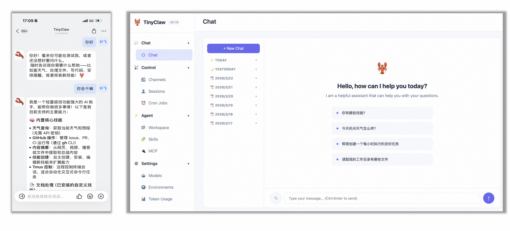

<div align="center">

# 🦞 TinyClaw

**超轻量个人 AI 助手** — 用 Java 编写，支持多模型、多通道、多 Agent 协同、自我进化的一站式 AI Agent 框架

[](https://openjdk.org/)
[](https://maven.apache.org/)
[](LICENSE)
[]()

[English README](./README.en.md)

</div>

---

### ✨ 特性一览

- **🤖 多模型支持** — 接入 OpenRouter、OpenAI、Anthropic、智谱 GLM、Gemini、阿里云、Groq、Ollama 等主流 LLM 提供商
- **💬 多通道消息** — 同时连接 Telegram、Discord、WhatsApp、飞书、钉钉、QQ、MaixCam 等平台
- **🤝 多 Agent 协同** — 7 种协同模式（辩论/团队/角色扮演/共识/层级/工作流/动态路由），内置工作流引擎
- **🧬 自我进化** — 3 种 Prompt 自动优化策略（文本梯度/OPRO/自我反思）+ 记忆进化 + 反馈收集
- **🔌 MCP 协议** — 完整的 MCP 客户端，支持 SSE、Stdio、Streamable HTTP 三种传输方式
- **🛠️ 丰富的内置工具** — 文件读写、Shell 执行、网络搜索、网页抓取、定时任务、子代理、Token 统计等 15 个工具
- **🧩 技能插件系统** — 通过 Markdown 定义技能，支持语义搜索匹配、从 GitHub 安装，Agent 可自主创建和改进技能
- **⏰ 定时任务引擎** — 支持 Cron 表达式、固定间隔和单次定时
- **🧠 记忆与上下文** — 长期记忆存储、会话摘要、分段式上下文构建
- **💓 心跳服务** — 定期自主思考，让 Agent 保持"活跃"
- **🎤 语音转写** — 集成阿里云 DashScope Paraformer，支持语音消息自动转文字
- **🔒 安全沙箱** — 工作空间限制 + 命令黑名单 + Web 安全中间件，生产级安全防护
- **🌐 Agent 社交网络** — 支持接入 ClawdChat.ai，与其他 Agent 通信协作
- **🖥️ Web 控制台** — 内置 Web UI，16 个 REST API，可视化管理 Agent 状态、会话、模型、技能等
- **🎬 Demo 模式** — 一键演示核心功能



---

### 📦 项目架构

```
src/main/java/io/leavesfly/tinyclaw/
├── TinyClaw.java                    # 应用入口，命令注册与分发
├── agent/                           # Agent 核心引擎
│   ├── AgentLoop.java               #   生命周期管理与消息消费主循环
│   ├── MessageRouter.java           #   消息路由（用户/系统/指令）
│   ├── ProviderManager.java         #   LLM Provider 管理与热重载
│   ├── LLMExecutor.java             #   LLM 调用与工具迭代循环
│   ├── ContextBuilder.java          #   分段式上下文构建
│   ├── SessionSummarizer.java       #   会话摘要与上下文压缩
│   ├── context/                     #   上下文分段模块（Identity/Bootstrap/Tools/Skills/Memory）
│   ├── evolution/                   #   自我进化引擎（PromptOptimizer/FeedbackManager/MemoryEvolver）
│   └── collaboration/               #   多 Agent 协同编排（7 种模式 + 工作流引擎）
├── bus/                             # 消息总线（发布/订阅，入站/出站队列）
├── channels/                        # 消息通道适配器（7 种平台）
├── cli/                             # 命令行接口（8 个命令）
├── config/                          # 配置模型与加载（11 个配置类）
├── cron/                            # 定时任务引擎
├── heartbeat/                       # 心跳服务
├── logger/                          # 结构化日志封装
├── mcp/                             # MCP 协议集成（3 种传输方式）
├── providers/                       # LLM 调用抽象（HTTPProvider + StreamEvent）
├── security/                        # 安全沙箱（SecurityGuard）
├── session/                         # 会话管理与持久化
├── skills/                          # 技能系统（加载/注册/搜索/安装）
├── tools/                           # Agent 工具集（15 个内置工具 + MCP 桥接）
├── util/                            # 工具类
├── voice/                           # 语音转写（AliyunTranscriber）
└── web/                             # Web 控制台（16 个 REST API Handler）
```

---

### 🚀 快速开始

#### 环境要求

- **Java 17** 或更高版本
- **Maven 3.x**
- 至少一个 LLM API Key（推荐 [OpenRouter](https://openrouter.ai/keys) 或 [智谱 GLM](https://open.bigmodel.cn/)）

#### 1. 构建项目

```bash
git clone <repo-url>
cd TinyClaw
mvn clean package -DskipTests
```

构建完成后，可执行 JAR 位于 `target/tinyclaw-0.1.0.jar`。

#### 2. 初始化配置

```bash
java -jar target/tinyclaw-0.1.0.jar onboard
```

该命令会：
- 在 `~/.tinyclaw/config.json` 创建默认配置文件
- 在 `~/.tinyclaw/workspace/` 创建工作空间目录
- 生成模板文件（`AGENTS.md`、`SOUL.md`、`USER.md`、`IDENTITY.md`）

#### 3. 配置 API Key

编辑 `~/.tinyclaw/config.json`，填入你的 API Key：

```json
{
  "providers": {
    "openrouter": {
      "apiKey": "sk-or-v1-your-key-here",
      "apiBase": "https://openrouter.ai/api/v1"
    },
    "zhipu": {
      "apiKey": "your-zhipu-key-here",
      "apiBase": "https://open.bigmodel.cn/api/paas/v4"
    },
    "dashscope": {
      "apiKey": "sk-your-dashscope-key-here",
      "apiBase": "https://dashscope.aliyuncs.com/compatible-mode/v1"
    }
  }
}
```

#### 4. 开始对话

```bash
# 单条消息模式
java -jar target/tinyclaw-0.1.0.jar agent -m "你好，介绍一下你自己"

# 交互模式
java -jar target/tinyclaw-0.1.0.jar agent
```

---

### 📖 命令参考

| 命令 | 说明 | 示例 |
|------|------|------|
| `onboard` | 初始化配置和工作空间 | `tinyclaw onboard` |
| `agent` | 与 Agent 直接交互 | `tinyclaw agent -m "Hello"` |
| `gateway` | 启动网关服务（连接所有通道） | `tinyclaw gateway` |
| `status` | 查看系统状态和配置 | `tinyclaw status` |
| `cron` | 管理定时任务 | `tinyclaw cron list` |
| `skills` | 管理技能插件 | `tinyclaw skills list` |
| `mcp` | 管理 MCP 服务器 | `tinyclaw mcp list` |
| `demo` | 运行内置演示流程 | `tinyclaw demo agent-basic` |
| `version` | 显示版本信息 | `tinyclaw version` |

#### Agent 命令选项

```bash
tinyclaw agent [options]

  -m, --message <text>    发送单条消息并退出
  -s, --session <key>     指定会话键（默认：cli:default）
  -d, --debug             启用调试模式
```

#### Cron 命令选项

```bash
tinyclaw cron list                          # 列出所有定时任务
tinyclaw cron add --name "日报" \
  --message "生成今日工作总结" \
  --cron "0 18 * * *"                       # 每天 18:00 执行
tinyclaw cron add --name "心跳" \
  --message "检查系统状态" \
  --every 3600                              # 每小时执行
tinyclaw cron remove <job_id>               # 移除任务
tinyclaw cron enable <job_id>               # 启用任务
tinyclaw cron disable <job_id>              # 禁用任务
```

#### Skills 命令选项

```bash
tinyclaw skills list                        # 列出已安装技能
tinyclaw skills list-builtin                # 列出内置技能
tinyclaw skills install-builtin             # 安装所有内置技能
tinyclaw skills install owner/repo/skill    # 从 GitHub 安装
tinyclaw skills show <name>                 # 查看技能详情
tinyclaw skills remove <name>               # 移除技能
```

---

### 🔌 支持的 LLM 提供商

| 提供商 | 配置字段 | 说明 |
|--------|----------|------|
| [OpenRouter](https://openrouter.ai/) | `providers.openrouter` | 聚合多模型网关，推荐首选 |
| [OpenAI](https://platform.openai.com/) | `providers.openai` | GPT 系列模型 |
| [Anthropic](https://www.anthropic.com/) | `providers.anthropic` | Claude 系列模型 |
| [智谱 GLM](https://open.bigmodel.cn/) | `providers.zhipu` | GLM-4 系列，国内推荐 |
| [Google Gemini](https://ai.google.dev/) | `providers.gemini` | Gemini 系列模型 |
| [Groq](https://groq.com/) | `providers.groq` | 超快推理 |
| [Ollama](https://ollama.ai/) | `providers.ollama` | 本地部署开源模型 |
| [阿里云 DashScope](https://dashscope.aliyun.com/) | `providers.dashscope` | Qwen 系列模型（通义千问） |

所有提供商均通过统一的 `HTTPProvider` 适配 OpenAI 兼容 API 格式，切换模型只需修改配置。

---

### 💬 支持的消息通道

| 通道 | 配置字段 | 所需凭证 |
|------|----------|----------|
| Telegram | `channels.telegram` | Bot Token |
| Discord | `channels.discord` | Bot Token |
| WhatsApp | `channels.whatsapp` | Bridge URL |
| 飞书 | `channels.feishu` | App ID + App Secret |
| 钉钉 | `channels.dingtalk` | Client ID + Client Secret |
| QQ | `channels.qq` | App ID + App Secret |
| MaixCam | `channels.maixcam` | Host + Port |

每个通道都支持 `allowFrom` 白名单配置，确保只有授权用户可以与 Agent 交互。

---

### 🛠️ 内置工具

Agent 在对话中可以自主调用以下工具：

| 工具 | 说明 | 安全特性 |
|------|------|----------|
| `read_file` | 读取文件内容 | ✓ 工作空间限制 |
| `write_file` | 写入文件（创建或覆盖） | ✓ 工作空间限制 |
| `append_file` | 追加内容到文件 | ✓ 工作空间限制 |
| `edit_file` | 基于 diff 的精确文件编辑 | ✓ 工作空间限制 |
| `list_dir` | 列出目录内容 | ✓ 工作空间限制 |
| `exec` | 执行 Shell 命令 | ✓ 命令黑名单 + 工作目录限制 |
| `web_search` | 网络搜索（Brave Search API） | - |
| `web_fetch` | 抓取网页内容 | - |
| `message` | 向指定通道发送消息 | - |
| `cron` | 创建/管理定时任务 | - |
| `spawn` | 生成子代理执行独立任务 | - |
| `collaborate` | 启动多 Agent 协同（7 种模式） | - |
| `social_network` | 与其他 Agent 通信（ClawdChat.ai） | - |
| `skills` | 管理和查询技能插件 | - |
| `token_usage` | 查询 Token 用量统计 | - |

此外，通过 MCP 协议接入的外部工具会自动注册到工具系统中，LLM 可直接调用。

---

### 🤝 多 Agent 协同

TinyClaw 内置了完整的多 Agent 协同编排系统，通过 `collaborate` 工具触发：

| 模式 | 说明 |
|------|------|
| `debate` | 正反方辩论，适合利弊权衡和方案评审 |
| `team` | 任务分解为子任务，支持并行/串行执行 |
| `roleplay` | 多角色对话模拟、场景演练 |
| `consensus` | 多方讨论后投票达成共识 |
| `hierarchy` | 层级汇报式决策，逐层汇总 |
| `workflow` | 多步骤工作流，支持 LLM 动态生成工作流定义 |
| `dynamic` | Router Agent 动态选择下一个发言者 |

工作流引擎支持 6 种节点类型：SINGLE / PARALLEL / SEQUENTIAL / CONDITIONAL / LOOP / AGGREGATE。

---

### 🧬 自我进化

TinyClaw 内置自我进化引擎，Agent 能持续从交互中学习和改进：

- **Prompt 自动优化**：3 种策略（文本梯度 / OPRO / 自我反思），自动改进系统提示
- **记忆进化**：从对话中提取长期记忆，跨会话保留重要信息
- **反馈收集**：支持显式评分、文字反馈和隐式信号

---

### 🔌 MCP 协议集成

TinyClaw 实现了完整的 MCP（Model Context Protocol）客户端：

| 传输方式 | 适用场景 |
|----------|----------|
| SSE | 远程 HTTP 服务器（Server-Sent Events） |
| Stdio | 本地进程通信（标准输入/输出） |
| Streamable HTTP | 远程 HTTP 服务器（流式 HTTP） |

MCP 服务器的工具会自动注册到工具系统中，LLM 可直接调用。配置示例：

```json
{
  "mcpServers": {
    "filesystem": {
      "command": "npx",
      "args": ["-y", "@modelcontextprotocol/server-filesystem", "/path/to/dir"],
      "timeout": 30
    }
  }
}
```

---

### 🔒 安全防护

TinyClaw 通过 **SecurityGuard** 提供多层安全防护：

- **工作空间沙箱**：所有文件操作限制在 workspace 目录内
- **命令黑名单**：阻止 `rm -rf`、`mkfs`、`sudo` 等危险命令
- **通道白名单**：每个通道配置 `allowFrom`，只有授权用户可交互
- **Web 安全中间件**：认证与 CORS 防护
- **路径规范化**：防止路径遍历攻击

---

### 🖥️ Web 控制台

网关模式下，访问 `http://localhost:18791` 可使用 Web 控制台：

- 实时对话（支持 SSE 流式输出）
- 会话管理与历史记录
- 模型切换（运行时热重载）
- Provider 管理
- 通道状态监控
- 技能管理
- 定时任务管理
- MCP 服务器管理
- 文件浏览与上传
- Token 用量统计
- 用户反馈收集

---

### 🧩 技能系统

技能是通过 Markdown 文件定义的 Agent 能力扩展：

```markdown
---
name: my-skill
description: "我的自定义技能"
---

# My Skill

当用户要求执行某某任务时，按照以下步骤操作：
1. ...
2. ...
```

- 支持从 workspace / global / builtin 三个目录加载
- 支持从 GitHub 安装社区技能
- 支持基于用户输入的**语义搜索匹配**，只注入相关技能
- Agent 可通过 `skills` 工具自主创建、编辑和管理技能

---

### 🌐 网关模式

```bash
java -jar target/tinyclaw-0.1.0.jar gateway
```

启动后，网关会：
1. 加载配置并初始化 LLM 提供商
2. 初始化安全防护（SecurityGuard）
3. 注册所有内置工具
4. 初始化 MCP 服务器连接
5. 启动定时任务服务
6. 启动心跳服务（如已启用）
7. 连接所有已启用的消息通道
8. 启动 Web 控制台
9. 在后台运行 Agent 消息处理循环

按 `Ctrl+C` 优雅关闭所有服务。

---

### 🗂️ 工作空间结构

```
~/.tinyclaw/
├── config.json              # 主配置文件
├── workspace/
│   ├── AGENTS.md            # Agent 行为指令
│   ├── SOUL.md              # Agent 个性与价值观
│   ├── USER.md              # 用户画像与偏好
│   ├── IDENTITY.md          # Agent 身份描述
│   ├── memory/              # 长期记忆
│   │   ├── MEMORY.md
│   │   └── HEARTBEAT.md
│   ├── sessions/            # 会话持久化
│   ├── skills/              # 用户技能
│   ├── cron/                # 定时任务
│   │   └── jobs.json
│   ├── evolution/           # 进化数据
│   │   └── prompts/         # Prompt 变体
│   └── collaboration/       # 协同记录
```

---

### 🎬 Demo 演示

```bash
# 一键演示模式
tinyclaw demo agent-basic

# 本地 CLI 助手
tinyclaw agent

# 网关 + 通道机器人
tinyclaw gateway

# Web 控制台
open http://localhost:18791

# MCP 服务器管理
tinyclaw mcp list
```

---

### 🧪 测试

```bash
mvn test                        # 运行所有测试
mvn test -Dtest=TinyClawTest    # 运行指定测试类
```

---

### 🛣️ 技术栈

| 组件 | 技术 |
|------|------|
| 语言 | Java 17 |
| 构建 | Maven |
| HTTP 客户端 | OkHttp 4.12 |
| JSON 处理 | Jackson 2.17 |
| 日志 | SLF4J + Logback |
| 命令行 | JLine 3.25 |
| 定时任务 | cron-utils 9.2 |
| 环境变量 | dotenv-java 3.0 |
| 测试 | JUnit 5.10 + Mockito 5.10 |

---

### 📄 License

[MIT License](https://opensource.org/licenses/MIT) — 自由使用、修改和分发。