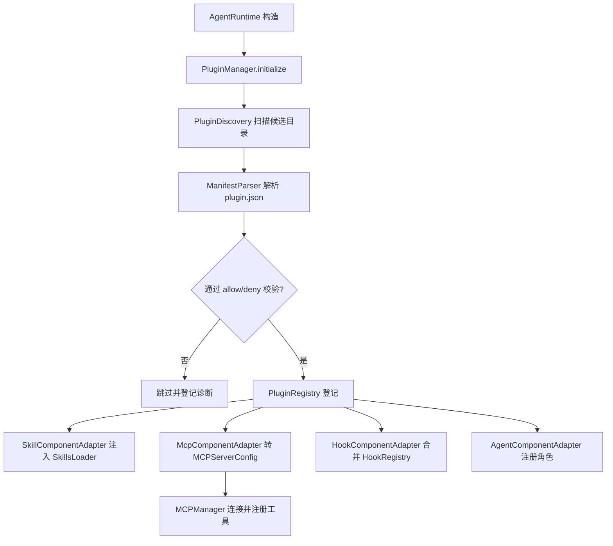
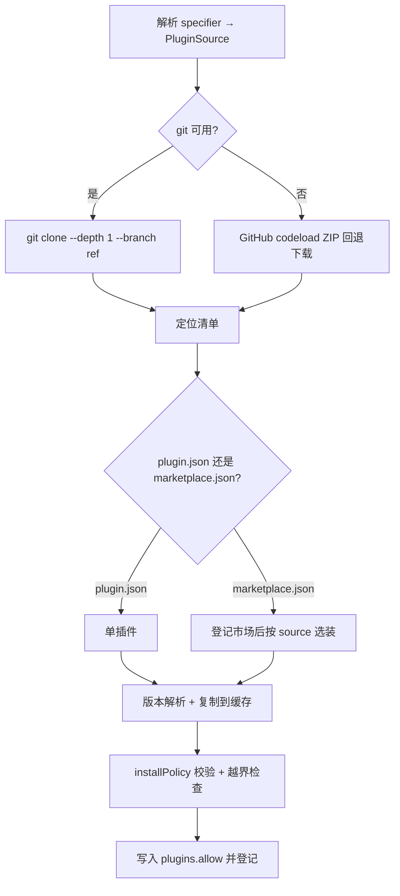

# TinyClaw 插件兼容设计文档

> 兼容 Claude Code 插件标准（主）与 OpenClaw 插件生态（次）的工程落地设计

| 项 | 内容 |
|----|------|
| 文档版本 | v1.0（Draft） |
| 状态 | 待评审 |
| 目标读者 | TinyClaw 核心开发、插件生态贡献者 |
| 关联文档 | [docs/architecture.md](architecture.md)、[wiki/20-extending.md](../wiki/20-extending.md)、[wiki/13-skills-system.md](../wiki/13-skills-system.md)、[docs/hooks-guide.md](hooks-guide.md) |

---

## 1. 背景与目标

### 1.1 背景

TinyClaw 目前采用「接口优先」的扩展架构（见 [wiki/20-extending.md](../wiki/20-extending.md)），扩展点包括 `Tool`、`Channel`、`LLMProvider`、`HookHandler`、技能（Markdown `SKILL.md`）、MCP 客户端等，但**没有统一的插件（Plugin）打包、分发与安装机制**，也没有插件类加载器。

与此同时，业界已形成以 **Claude Code 插件标准**为核心的事实规范：一个插件是自包含目录，通过 `.claude-plugin/plugin.json` 清单声明 skills / agents / hooks / MCP servers 等组件，并通过 `.claude-plugin/marketplace.json` 市场目录分发。**OpenClaw 的插件系统本身即兼容读取 Claude bundle**（`.claude-plugin/plugin.json`），Codex、Cursor 也各有兼容布局。

### 1.2 目标

1. 让 TinyClaw 能够**发现、安装、加载并运行**符合 Claude Code 插件标准的插件包，实现"一次打包、多端复用"。
2. 复用 TinyClaw 现有扩展点（`SkillsLoader`、`ToolRegistry`、`MCPManager`、`HookDispatcher`、`ChannelManager`），**最小侵入**地把插件各组件接入运行时。
3. 提供统一的 `PluginsConfig` 配置、CLI 命令与 Web 控制台管理入口，对齐 Claude Code / OpenClaw 的使用心智。
4. 明确**能兼容什么、不能兼容什么**，给出降级策略与安全边界。

### 1.3 非目标

- 不实现在 JVM 内直接运行 TypeScript/JavaScript 插件代码（原生同进程加载）。
- 不实现 LSP、theme、output-style、monitor 等与 TinyClaw 运行形态无关或价值低的组件（首期仅登记，不执行）。
- 不自建插件市场服务端，仅兼容 Claude Code `marketplace.json` 目录格式。

---

## 2. 术语与参考标准

| 术语 | 含义 |
|------|------|
| Plugin（插件） | 一个自包含目录，含 `.claude-plugin/plugin.json` 清单与若干组件 |
| Marketplace（市场） | `.claude-plugin/marketplace.json` 目录，列出多个插件及其来源 |
| Component（组件） | 插件内的可扩展单元：skill / agent / hook / mcpServer / command 等 |
| Bundle（兼容包） | 映射到 Claude / Codex / Cursor 布局的插件目录 |
| Bridge（桥接） | 通过外部进程（MCP Server / Node 边车）间接消费插件运行时能力 |

**参考标准**：
- Claude Code Plugins Reference：`code.claude.com/docs/en/plugins-reference`
- Claude Code Marketplace：`code.claude.com/docs/en/plugin-marketplaces`
- OpenClaw Plugin：`docs.openclaw.ai/plugins/architecture`、`docs.openclaw.ai/zh-CN/tools/plugin`

---

## 3. 现状分析：TinyClaw 现有扩展点

| 扩展点 | 核心类 | 装配入口 | 与插件组件的对应 |
|--------|--------|----------|------------------|
| 工具 | [`Tool`](../src/main/java/io/leavesfly/tinyclaw/tools/Tool.java) / `ToolRegistry` | `AgentRuntime.registerTool` | plugin `mcpServers` 工具、`bin/` |
| 技能 | [`SkillsLoader`](../src/main/java/io/leavesfly/tinyclaw/skills/SkillsLoader.java) / `SkillInfo` | `SkillsLoader` 扫描目录 | plugin `skills/`、`commands/` |
| 技能安装 | [`SkillsInstaller`](../src/main/java/io/leavesfly/tinyclaw/skills/SkillsInstaller.java) | GitHub / ZIP / tar.gz | plugin 安装管线可复用下载解压 |
| MCP | [`MCPManager`](../src/main/java/io/leavesfly/tinyclaw/mcp/MCPManager.java) / `MCPServersConfig` | `AgentRuntime.initializeMCPServers` | plugin `.mcp.json` |
| 钩子 | `HookDispatcher` / `HookRegistry` / `HookHandler` | `HookConfigLoader` | plugin `hooks/hooks.json` |
| 通道 | `Channel` / `ChannelManager` | `ChannelManager.createChannels` | plugin `channels` |
| 配置 | [`Config`](../src/main/java/io/leavesfly/tinyclaw/config/Config.java) / `ConfigLoader` | 启动加载 | 新增 `PluginsConfig` |

**关键复用点**：
1. [`MCPManager`](../src/main/java/io/leavesfly/tinyclaw/mcp/MCPManager.java) 已支持 `stdio` 传输并把每个 MCP 工具注册为独立 `Tool`（`initializeServer` 中 `toolRegistry.register(new MCPTool(...))`）。插件 `.mcp.json` 可**几乎零成本**接入。
2. [`SkillsInstaller`](../src/main/java/io/leavesfly/tinyclaw/skills/SkillsInstaller.java) 已实现 GitHub 克隆、ZIP/tar.gz 下载解压与 `SKILL.md` 定位，插件安装管线可直接复用其下载/解压逻辑。
3. [`SkillsLoader`](../src/main/java/io/leavesfly/tinyclaw/skills/SkillsLoader.java) 已支持从多目录按优先级加载 `SKILL.md` + YAML frontmatter，插件 `skills/` 只需追加为一个扫描源。

**现有缺口**：
- `SkillInfo` 仅含 `name/path/source/description`，缺 `tags/triggers/model`，需补齐以承载 Claude skill frontmatter。
- 无插件清单模型、无插件发现/注册/安装组件、无 `PluginsConfig`。
- `HookHandler` 仅支持 `command` 类型，Claude hooks 的 `http/mcp_tool/prompt/agent` 类型缺失。

---

## 4. 兼容标准选型

### 4.1 为什么以 Claude Code 标准为主

1. **事实标准 + 生态最大**：Claude Code 插件与 marketplace 已是社区最广泛采用的格式。
2. **OpenClaw 天然兼容读取 Claude bundle**：实现 Claude Code 兼容 = 同时获得 OpenClaw 兼容 bundle 能力，一箭双雕。
3. **格式友好、可静态解析**：`plugin.json` / `marketplace.json` 为纯 JSON，允许在**不执行插件代码**的前提下完成发现与校验，符合 TinyClaw 安全模型。
4. **组件与 TinyClaw 扩展点高度对齐**：skills、hooks、MCP servers 均有现成对应。

### 4.2 兼容层级与可行性

| 层级 | 目标 | 可行性 | 依赖 |
|------|------|--------|------|
| L1 元数据/清单 | 解析 `plugin.json` / `marketplace.json`，登记插件 | ⭐⭐⭐⭐⭐ | 纯 Java |
| L2 技能组件 | `skills/` `commands/` → `SkillsLoader` | ⭐⭐⭐⭐⭐ | 补齐 `SkillInfo` |
| L3 MCP 组件 | `.mcp.json` → `MCPManager` | ⭐⭐⭐⭐ | 变量替换 |
| L4 安装/分发 | marketplace / git / local 安装 | ⭐⭐⭐⭐ | 复用 `SkillsInstaller` |
| L5 钩子组件 | `hooks/hooks.json` → `HookDispatcher` | ⭐⭐⭐ | 事件名映射 + 新增 hook 类型 |
| L6 agent 组件 | `agents/*.md` → 子 Agent 角色 | ⭐⭐⭐ | 映射到 `collaboration.RoleAgent` |
| L7 通道组件 | `channels` → `ChannelManager` | ⭐⭐ | 经 MCP 桥 |
| L8 原生 TS 运行时 | 进程内执行插件代码 | ❌ 不做 | — |

**结论**：首期聚焦 **L1~L4**（清单 + 技能 + MCP + 安装），这已能覆盖绝大多数"skills 型 / MCP 型"插件；L5~L7 作为增强分阶段推进；L8 明确不做，改由 MCP 边车降级。

---

## 5. Claude Code 插件标准规范摘要

> 供实现对照，字段以 Claude Code Plugins Reference 为准。

### 5.1 插件目录结构

```text
my-plugin/
├── .claude-plugin/
│   └── plugin.json          # 清单（可选；仅 name 必填）
├── skills/                  # 技能：<name>/SKILL.md（+ scripts/ references/）
│   └── code-reviewer/SKILL.md
├── commands/                # 扁平 .md 技能文件
├── agents/                  # 子 agent 定义（*.md + frontmatter）
├── hooks/hooks.json         # 钩子配置
├── .mcp.json                # MCP server 定义
├── .lsp.json                # LSP（TinyClaw 不执行）
├── monitors/monitors.json   # 后台监控（TinyClaw 不执行）
├── output-styles/ themes/   # 输出风格/主题（TinyClaw 不执行）
├── bin/                     # 加入 PATH 的可执行文件
└── scripts/                 # hook/工具脚本
```

**约束**：除 `plugin.json` 外，所有组件目录必须位于插件根，不能放进 `.claude-plugin/`。

### 5.2 `plugin.json` 关键字段

| 字段 | 类型 | 说明 | 首期支持 |
|------|------|------|:-------:|
| `name`（必填） | string | kebab-case 唯一标识，用于命名空间 | ✅ |
| `displayName` | string | 展示名 | ✅ |
| `version` | string | 语义化版本；缺省用 git SHA | ✅ |
| `description` / `author` / `homepage` / `repository` / `license` / `keywords` | 多 | 元数据 | ✅ |
| `skills` | string\|array | 追加技能目录（默认 `skills/` 始终扫描） | ✅ |
| `commands` | string\|array | 扁平技能文件（替换默认 `commands/`） | ✅ |
| `agents` | string\|array | agent 文件（替换默认 `agents/`） | L6 |
| `hooks` | string\|array\|object | 钩子配置路径或内联 | L5 |
| `mcpServers` | string\|array\|object | MCP 配置路径或内联 | ✅ |
| `userConfig` | object | 启用时向用户索取的配置（含 `sensitive`） | ✅ |
| `channels` | array | 消息通道声明（绑定 mcpServers） | L7 |
| `dependencies` | array | 依赖的其它插件（可带 semver） | L4 |
| `defaultEnabled` | boolean | 安装后默认是否启用（默认 true） | ✅ |
| `lspServers` / `experimental.{themes,monitors}` / `outputStyles` | 多 | TinyClaw 不执行，仅登记 | 登记 |

**未识别字段**：Claude Code 对未识别的顶层字段仅告警不报错。TinyClaw 需遵循同样宽容策略（允许同一清单兼容 npm/VS Code/OpenClaw 元数据）。

### 5.3 环境变量与路径

- 所有组件路径必须相对插件根、以 `./` 开头，禁止 `../` 越界。
- 变量替换（在 hook 命令、MCP/LSP 配置、monitor 命令中）：
  - `${CLAUDE_PLUGIN_ROOT}`：插件安装绝对路径
  - `${CLAUDE_PLUGIN_DATA}`：跨版本持久化数据目录（`~/.claude/plugins/data/{id}/`）
  - `${CLAUDE_PROJECT_DIR}`：项目根
  - `${user_config.KEY}`：用户配置值；并以 `CLAUDE_PLUGIN_OPTION_<KEY>` 导出到子进程

### 5.4 `marketplace.json`

```json
{
  "name": "company-tools",
  "owner": { "name": "DevTools Team", "email": "dev@example.com" },
  "metadata": { "pluginRoot": "./plugins" },
  "plugins": [
    { "name": "code-formatter", "source": "./plugins/formatter", "version": "2.1.0" },
    { "name": "deployment-tools", "source": { "source": "github", "repo": "company/deploy-plugin" } }
  ]
}
```

- `source` 支持：本地相对路径、`{ "source": "github", "repo": "owner/repo" }`、`{ "source": "git", "url": "..." }`。
- 安装作用域：`user` / `project` / `local` / `managed`（TinyClaw 映射为 global / workspace / workspace-local）。

### 5.5 组件语义要点

- **Skill**：`SKILL.md` YAML frontmatter（`name`/`description`），插件内技能命名空间化为 `plugin-name:skill`。
- **Hook**：事件（`PreToolUse`/`PostToolUse`/`SessionStart`/`UserPromptSubmit`/`Stop`/`SessionEnd` 等）+ `matcher` + 类型（`command`/`http`/`mcp_tool`/`prompt`/`agent`）。
- **Agent**：frontmatter `name`/`description`/`model`/`tools`/`disallowedTools`；安全起见插件 agent **不支持** `hooks`/`mcpServers`/`permissionMode`。
- **MCP Server**：标准 MCP 配置（`command`/`args`/`env`/`cwd`），启用即随插件启动。

---

## 6. 能力映射：Claude 组件 → TinyClaw 扩展点

| Claude 组件 | TinyClaw 落点 | 适配方式 | 阶段 |
|-------------|---------------|----------|:----:|
| `skills/`、`commands/` | [`SkillsLoader`](../src/main/java/io/leavesfly/tinyclaw/skills/SkillsLoader.java) 追加扫描源 | `SkillBundleAdapter` 注入，命名空间 `plugin:skill` | L2 |
| `.mcp.json` / `mcpServers` | [`MCPManager`](../src/main/java/io/leavesfly/tinyclaw/mcp/MCPManager.java) | 转换为 `MCPServerConfig` 后交由 MCPManager，工具自动注册 | L3 |
| `bin/` 可执行 | `ExecTool` PATH 注入 | 启用时把 `bin/` 加入工具执行环境 PATH | L3 |
| `hooks/hooks.json` | `HookDispatcher` | 事件名映射 + 变量替换；新增 `http` 等类型 | L5 |
| `agents/*.md` | `collaboration.RoleAgent` | frontmatter → 角色定义 | L6 |
| `channels` | `ChannelManager` | 绑定的 MCP server 经桥转发到 `MessageBus` | L7 |
| `userConfig` | `PluginsConfig.entries.<id>.config` | 启用时提示；`sensitive` 走安全存储 | ✅ |
| `lsp/theme/monitor/outputStyle` | 仅登记 | 不执行，`inspect` 可见 | 登记 |

---

## 7. 目标架构设计

### 7.1 新增 `plugins` 包

```text
io.leavesfly.tinyclaw.plugins/
├── model/
│   ├── PluginManifest.java       # plugin.json 统一模型（宽容未知字段）
│   ├── MarketplaceManifest.java  # marketplace.json 模型
│   ├── PluginSource.java         # local / github / git 来源
│   └── UserConfigOption.java     # userConfig 选项
├── ManifestParser.java           # 解析 .claude-plugin/.codex-plugin/.cursor-plugin
├── PluginDiscovery.java          # 发现候选：workspace/global/config paths/内置
├── PluginRegistry.java           # 已加载插件索引（线程安全，仿 ToolRegistry）
├── PluginInstaller.java          # 安装：local/github/git/marketplace（复用 SkillsInstaller）
├── PluginManager.java            # 装配总线：把各组件接入运行时
├── VariableResolver.java         # ${CLAUDE_PLUGIN_ROOT} 等变量替换
├── adapter/
│   ├── SkillComponentAdapter.java   # skills/commands → SkillsLoader
│   ├── McpComponentAdapter.java     # .mcp.json → MCPManager
│   ├── HookComponentAdapter.java    # hooks.json → HookDispatcher
│   └── AgentComponentAdapter.java   # agents → RoleAgent
└── bridge/
    └── NodeBridge.java           # （可选）原生 TS 插件经 stdio MCP 暴露
```

配置层新增：`config/PluginsConfig.java`，挂载到 [`Config`](../src/main/java/io/leavesfly/tinyclaw/config/Config.java)。

### 7.2 装配时序



### 7.3 与 AgentRuntime 的集成点

- 在 [`AgentRuntime`](../src/main/java/io/leavesfly/tinyclaw/agent/AgentRuntime.java) 构造末尾（`initializeMCPServers()` 之前）插入 `initializePlugins()`：
  1. `PluginManager` 收集所有启用插件的 MCP 组件，**合并进** `config.getMcpServers()` 后再交给现有 `initializeMCPServers()`，避免重复的连接逻辑。
  2. 技能组件通过 `contextBuilder.getSkillsLoader()` 追加扫描源。
  3. 钩子组件在 `HookConfigLoader.loadDefault()` 之后合并进 `HookRegistry`。
- 生命周期：`stop()` 时调用 `PluginManager.shutdown()`，关闭桥接进程、注销工具。

---

## 8. 关键设计详述

### 8.1 清单解析（ManifestParser）

- 输入：插件根目录。按优先级探测清单：
  1. `.claude-plugin/plugin.json`（Claude / 首选）
  2. `openclaw.plugin.json`（OpenClaw 原生）
  3. `.codex-plugin/plugin.json`、`.cursor-plugin/plugin.json`
  4. 无清单但根目录存在 `SKILL.md` → 视为单技能插件，name 取 frontmatter 或目录名
- 宽容策略：未知顶层字段仅记 warning；类型错误（如 `keywords` 非数组）判为加载错误。
- 输出：统一 `PluginManifest`（含 `components` 归一化后的相对路径列表）。

### 8.2 技能组件适配（SkillComponentAdapter）

- 默认扫描插件根 `skills/`；叠加清单 `skills` 字段目录；`commands/*.md` 作为扁平技能。
- 命名空间：注册名为 `<plugin-name>:<skill-name>`，避免与工作区技能冲突。
- 需先扩展 `SkillInfo`：新增 `tags`、`triggers`、`model`、`origin=PLUGIN`、`pluginId` 字段，并让 [`SkillsLoader`](../src/main/java/io/leavesfly/tinyclaw/skills/SkillsLoader.java) 解析对应 frontmatter。

### 8.3 MCP 组件适配（McpComponentAdapter）

- 读取插件 `.mcp.json` 或清单内联 `mcpServers`，对每个 server：
  1. 变量替换 `command`/`args`/`env`/`cwd` 中的 `${CLAUDE_PLUGIN_ROOT}` 等。
  2. 映射为 [`MCPServersConfig.MCPServerConfig`](../src/main/java/io/leavesfly/tinyclaw/config/MCPServersConfig.java)（stdio → command/args/env；http → endpoint）。
  3. server 命名空间化为 `plugin:<plugin-name>:<server-name>`，与用户 MCP 隔离。
- 交由现有 [`MCPManager`](../src/main/java/io/leavesfly/tinyclaw/mcp/MCPManager.java) 连接，工具自动进入 `ToolRegistry`。**这是运行时能力兼容的核心，不新增协议。**

### 8.4 安装管线（PluginInstaller）

- 来源解析：
  - `local` / `--plugin-dir`：直接登记，不复制（开发态）
  - `github` / `git`：复用 [`SkillsInstaller`](../src/main/java/io/leavesfly/tinyclaw/skills/SkillsInstaller.java) 的克隆/下载逻辑
  - `marketplace`：先拉取 `.claude-plugin/marketplace.json`，解析 `plugins[].source` 后按上面来源安装
- 缓存：安装到 `~/.tinyclaw/plugins/cache/<id>@<marketplace>/<version>/`，每版本独立目录（对齐 Claude 缓存模型）。
- 安装即写入 `plugins.allow`（对齐 OpenClaw 行为），并触发 `security.installPolicy` 校验。
- git / marketplace 来源的完整流程详见下文 §8.5。

### 8.5 git 仓库安装（详述）

git 仓库是插件的主要分发方式之一。TinyClaw 支持两种安装语义：

- **（A）直接安装单个插件**：git 链接指向一个插件目录（根含 `.claude-plugin/plugin.json`；若无清单但存在 `SKILL.md`，退化为单技能插件）。
- **（B）注册/安装市场（marketplace-in-git）**：git 链接指向含 `.claude-plugin/marketplace.json` 的仓库，注册后再从中选装插件，对齐 Claude Code 的 `/plugin marketplace add <git>` 心智。

#### 8.5.1 支持的链接格式

| 格式 | 示例 | 语义 |
|------|------|------|
| GitHub 简短 | `owner/repo`、`owner/repo/subdir` | 默认 GitHub，`subdir` 支持 monorepo 子目录 |
| HTTPS | `https://github.com/owner/repo`、`https://gitlab.com/x/y.git` | 任意 git host |
| SSH | `git@github.com:owner/repo.git` | 私有仓库 |
| 显式前缀 + ref | `git:https://gitlab.com/x/y.git@v1.2.0` | `@<ref>` 指定 branch / tag / commit |

`@<ref>` 可为 branch / tag / commit SHA；缺省时取默认分支。CLI 示例：

```bash
tinyclaw plugins install owner/repo                       # GitHub 简短
tinyclaw plugins install git:https://gitlab.com/x/y.git@v1.2.0  # 指定 tag
tinyclaw plugins marketplace add git:owner/marketplace-repo    # 注册市场
```

#### 8.5.2 安装流程



1. **解析**：specifier → `PluginSource(kind, url, ref, subdir)`。
2. **拉取**：优先 `git clone --depth 1 [--branch <ref>]`；无 git 环境时回退 ZIP 下载（GitHub 用 `https://codeload.github.com/<owner>/<repo>/zip/refs/{heads|tags}/<ref>`），复用 [`SkillsInstaller`](../src/main/java/io/leavesfly/tinyclaw/skills/SkillsInstaller.java) 的下载/解压逻辑。
3. **定位**：在结果（或 `subdir`）中查找 `.claude-plugin/plugin.json`；若为市场仓库则查找 `.claude-plugin/marketplace.json`。
4. **版本解析**：`plugin.json.version` > tag > commit SHA（对齐 Claude：无 version 时用 commit SHA 作为版本）。
5. **缓存**：复制到 `~/.tinyclaw/plugins/cache/<id>@<source>/<version>/`，每版本独立目录。
6. **校验**：`security.installPolicy` + 路径越界（`../`）检查 + 清单 schema 校验。
7. **登记**：写入 `plugins.allow`，更新已装索引。

#### 8.5.3 版本固定、更新与回滚

- **固定**：`@<tag>` / `@<sha>` 精确固定；`@<branch>` 或无 ref 时取当次 commit SHA 作为版本，保证可复现。
- **更新**：`tinyclaw plugins update <id>` 对 branch 源执行 `git pull` / 重新拉取并比对 SHA，产生新版本缓存目录；旧版本目录保留 7 天宽限期后回收（对齐 Claude 缓存模型，避免正在运行的会话失效）。
- **回滚**：将 `plugins.entries.<id>.version` 指回旧缓存目录即可。

#### 8.5.4 私有仓库鉴权

- **SSH**：git 子进程继承宿主 `~/.ssh` 与 ssh-agent，无需额外配置。
- **HTTPS token**：通过环境变量或 `plugins.entries.<id>.auth` 注入到 git credential，**不落明文配置**（走 §10 安全存储）：

```json5
{ plugins: { entries: { "my-plugin": { auth: { tokenEnv: "MY_GIT_TOKEN" } } } } }
```

- **失败降级**：鉴权失败给出明确错误提示（区分"仓库不存在""无访问权限""ref 不存在"），不做放大风险的重试。

#### 8.5.5 复用与实现要点

- `PluginInstaller` 复用 [`SkillsInstaller`](../src/main/java/io/leavesfly/tinyclaw/skills/SkillsInstaller.java) 已有的 GitHub 克隆、ZIP/tar.gz 下载解压能力，**仅需把"定位 `SKILL.md`"替换为"定位 `.claude-plugin/plugin.json`（回退 `SKILL.md`）"**。
- marketplace-in-git：先只拉取并解析 `marketplace.json`（轻量），用户选定插件后再按其 `source` 走上述单插件安装流程。

### 8.6 原生 TS 运行时（可选，NodeBridge，L8 降级）

- 不在 JVM 内执行 TS。对确需运行时的原生插件，提供独立 Node 边车包，把插件 `registerTool` 的工具以 **stdio MCP server** 暴露，TinyClaw 侧当作一个 stdio MCP server 消费。
- 默认关闭，`plugins.bridge.enabled=true` 且显式 allowlist 才启用。

---

## 9. 配置设计（PluginsConfig）

```json5
{
  plugins: {
    enabled: true,
    allow: ["quality-review-plugin"],   // 排他允许列表（对齐 OpenClaw）
    deny: ["untrusted-plugin"],          // 优先级最高
    load: { paths: ["~/.tinyclaw/plugins", "./.tinyclaw/plugins"] },
    marketplaces: [                       // 已注册市场
      { name: "my-plugins", source: "github:owner/my-marketplace" }
    ],
    bridge: { enabled: false, nodePath: "node" },
    entries: {
      "quality-review-plugin": {
        enabled: true,
        config: { api_endpoint: "https://api.example.com" }  // 对应 userConfig
      }
    }
  }
}
```

**策略规则（对齐 Claude Code / OpenClaw）**：
- `plugins.enabled=false` → 关闭全部插件发现与加载。
- `deny` > `allow` > 单插件 `entries.<id>.enabled`。
- 未设 `allow` 时，工作区来源插件默认禁用，启动日志提示可自动加载的插件 id。
- `entries.<id>.config` 承载 `userConfig`；`sensitive` 值不落明文配置，走安全存储（复用 [`security`](../src/main/java/io/leavesfly/tinyclaw/security) 或系统 keychain）。

---

## 10. 安全设计

Claude Code / OpenClaw 的插件（尤其 MCP server、hook 脚本）**以宿主同等权限运行、不沙箱**。TinyClaw 引入时必须更严：

1. **默认白名单**：未在 `plugins.allow` 的插件不加载其可执行组件；工作区来源插件默认禁用。
2. **安装策略**：安装前执行 `security.installPolicy`，校验来源与清单；拒绝越界路径（`../`）。
3. **执行隔离**：插件 MCP server 作为独立子进程；其产出的工具调用仍经 [`SecurityGuard`](../src/main/java/io/leavesfly/tinyclaw/security) 沙箱与 `HookDispatcher` 的 PreToolUse 拦截。
4. **路径边界**：`${CLAUDE_PLUGIN_ROOT}` 限定在插件缓存目录内；符号链接越界一律跳过。
5. **敏感配置**：`userConfig.sensitive` 不写入 `settings`，导出为子进程环境变量时按需最小化。
6. **审计**：`plugins inspect <id>` 输出组件清单与来源溯源；无溯源来源标记 warning。

---

## 11. 分阶段实施计划

| 阶段 | 范围 | 关键交付物 | 预估 |
|------|------|-----------|:----:|
| **M0 骨架** | `plugins` 包骨架 + `PluginsConfig` + `Config` 挂载 + `plugins list` 空实现 | 编译通过、配置单测 | 1~2d |
| **M1 清单+技能（L1/L2）** | `ManifestParser`、`SkillComponentAdapter`、扩展 `SkillInfo` | Claude/OpenClaw skill 插件可被语义搜索命中 | 3~5d |
| **M2 MCP（L3）** | `McpComponentAdapter` + `VariableResolver`，合并进 `MCPManager` | 插件 `.mcp.json` 工具可被 Agent 调用 | 3~4d |
| **M3 安装/分发（L4）** | `PluginInstaller` + `marketplace.json` 解析（复用 `SkillsInstaller`） | `plugins install <src>` 全来源可用 | 4~5d |
| **M4 CLI/Web/诊断** | `PluginsCommand`、Web `PluginsHandler`、`plugins inspect` | 管理闭环 | 3~4d |
| **M5 钩子（L5）** | `HookComponentAdapter` + 事件映射 + 新增 hook 类型 | 插件 hooks 生效 | 3~5d |
| **M6 agent/通道（L6/L7）** | `AgentComponentAdapter`、channel 桥 | 增强能力 | 5~8d |
| **M7 原生桥（L8，可选）** | `NodeBridge` PoC | 原生 TS 工具经 MCP 桥可用 | 5~8d |

**建议路径**：M0 → M1 → M2 → M3 → M4 为最小可用闭环（MVP），覆盖"skills 型 + MCP 型"插件安装与运行；M5+ 按需推进。

---

## 12. 差异与限制

| 维度 | Claude Code / OpenClaw | TinyClaw 兼容后 |
|------|------------------------|-----------------|
| 原生运行时 | TS/JS 进程内加载 | 不支持；改 MCP 边车（默认关） |
| LSP/theme/monitor/output-style | 支持 | 仅登记，不执行 |
| 钩子事件 | 全量、类型化 | 首期映射常用事件与 `command` 类型 |
| 热重载 | `/reload-plugins` | 重启 gateway / 重连 MCP |
| 缓存路径变量 | `${CLAUDE_PLUGIN_ROOT}` 等 | 完全兼容 |
| 命名空间 | `plugin:component` | 完全兼容 |

**明确不做**：JVM 内执行插件 JS；LSP 代码智能；主题/输出风格渲染。

---

## 13. 兼容性测试策略

1. **样例插件矩阵**：准备 skills-only、mcp-only、hooks、混合型、marketplace 多插件等样例目录作为测试夹具。
2. **清单解析单测**：覆盖 Claude/OpenClaw/Codex/Cursor 四种布局、缺清单单技能、未知字段宽容、类型错误报错。
3. **端到端**：安装 → 启用 → 技能命中 / MCP 工具调用 → 卸载，全链路。
4. **回归**：确保插件 MCP 合并不破坏既有 `config.mcpServers`；技能命名空间不与工作区技能冲突。
5. **安全**：越界路径拒绝、deny 优先级、sensitive 不落盘。
6. **git 安装**：short / HTTPS / SSH / `@ref` 各格式解析、marketplace-in-git、私有仓库鉴权失败提示、版本固定（tag/SHA）与更新回滚。

---

## 14. 附录

### 14.1 最小兼容插件示例（skills 型）

```text
quality-review-plugin/
├── .claude-plugin/plugin.json
└── skills/quality-review/SKILL.md
```

```json
// .claude-plugin/plugin.json
{ "name": "quality-review-plugin", "version": "1.0.0",
  "description": "Adds a quality-review skill" }
```

### 14.2 MCP 型插件示例

```json
// .mcp.json
{
  "mcpServers": {
    "db": {
      "command": "node",
      "args": ["${CLAUDE_PLUGIN_ROOT}/server.js"],
      "env": { "DATA": "${CLAUDE_PLUGIN_DATA}" }
    }
  }
}
```

映射为 TinyClaw `MCPServerConfig`：`name=plugin:my-plugin:db`、`type=stdio`、`command=node`、`args=[<解析后的绝对路径>]`。

### 14.3 待决问题（Open Issues）

1. `userConfig.sensitive` 的安全存储后端选型（TinyClaw 当前无 keychain 抽象）。
2. 插件 agent 与 TinyClaw `collaboration` 角色模型的字段差异（`effort`/`maxTurns`/`isolation`）如何降级。
3. 是否需要在 `HookDispatcher` 引入类型化钩子的优先级/阻断语义以对齐 Claude。
4. marketplace 的 `renames`/`dependencies` 跨市场依赖策略是否首期支持。

---

_本文档为设计草案，落地前需评审确认兼容层级范围（建议先锁定 M0~M4 的 MVP）。_
