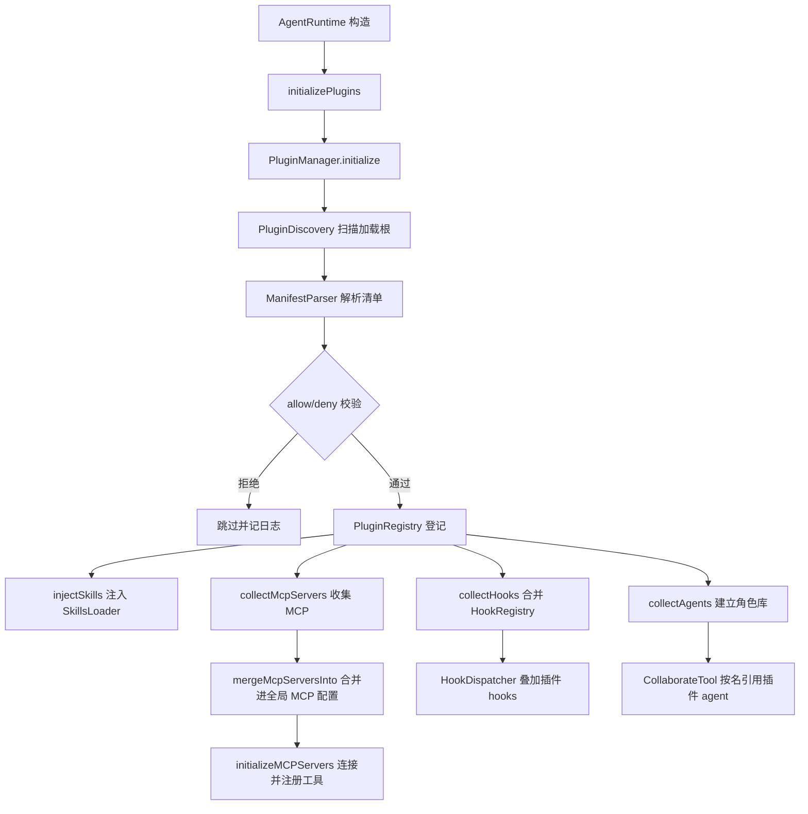

# 22 · 插件机制

> `plugins/` 包：兼容 **Claude Code** 插件标准（主）与 **OpenClaw** 生态（次），把一个自包含插件目录里的技能 / MCP / hooks / 子代理组件，**零协议改造**地接入 TinyClaw 运行时。

---

## 22.1 什么是插件

**插件（Plugin）**是一个自包含目录，通过 `.claude-plugin/plugin.json` 清单声明它携带哪些组件，一次打包即可在 Claude Code / OpenClaw / TinyClaw 之间复用。

与「扩展开发」（见 [20 · 扩展开发](20-extending.md)）的区别：

| 维度 | 扩展（Extending） | 插件（Plugin） |
|------|------------------|----------------|
| 形式 | Java 源码实现接口，重新打包 | 目录 + JSON 清单，无需改 TinyClaw 源码 |
| 分发 | Fork 仓库 | git / GitHub / 本地路径 / marketplace |
| 加载 | 编译期 | 运行时发现、装配（**不执行插件代码**） |
| 兼容 | TinyClaw 专属 | Claude Code / OpenClaw 通用 |

**核心设计原则**：插件的所有组件都被**适配**到 TinyClaw 现有扩展点（`SkillsLoader` / `MCPManager` / `HookDispatcher` / `AgentOrchestrator`），复用既有的连接、匹配与执行逻辑，因此**不新增任何协议**，也**不在 JVM 内执行 TS/JS 插件代码**。

> 完整设计背景与兼容层级分析见 [docs/plugin-compatibility-design.md](../docs/plugin-compatibility-design.md)。

---

## 22.2 插件目录结构

```text
my-plugin/
├── .claude-plugin/
│   └── plugin.json          # 清单（仅 name 建议必填；缺省回退目录名）
├── skills/                  # 技能：<name>/SKILL.md
│   └── code-reviewer/SKILL.md
├── agents/                  # 子代理定义：*.md（YAML frontmatter + 正文）
│   └── reviewer.md
├── hooks/hooks.json         # 钩子配置
└── .mcp.json                # MCP server 定义
```

**约束**：除 `plugin.json` 外，所有组件目录必须位于插件根，路径以 `./` 相对插件根，禁止 `../` 越界（[`ManifestParser.safeResolve`](../src/main/java/io/leavesfly/tinyclaw/plugins/ManifestParser.java) 强制校验）。

### 兼容的清单布局

[`ManifestParser`](../src/main/java/io/leavesfly/tinyclaw/plugins/ManifestParser.java) 按以下优先级探测清单：

| 优先级 | 清单文件 | layout | 来源 |
|:---:|----------|--------|------|
| 1 | `.claude-plugin/plugin.json` | `claude` | Claude Code（首选） |
| 2 | `openclaw.plugin.json` | `openclaw` | OpenClaw 原生 |
| 3 | `.codex-plugin/plugin.json` | `codex` | Codex |
| 4 | `.cursor-plugin/plugin.json` | `cursor` | Cursor |
| 5 | 无清单，根含 `SKILL.md` | `single-skill` | 单技能插件 |
| 6 | 无清单，根含 `skills/` 目录 | `skills-dir` | 技能集合插件 |

> 解析过程**只读 JSON 与目录结构**，不执行插件代码；未知顶层字段一律忽略（对齐 Claude Code 的宽容策略），保证同一份清单能兼容 npm / VS Code / OpenClaw 元数据。

---

## 22.3 `plugin.json` 关键字段

```json
{
  "name": "quality-review-plugin",
  "displayName": "Quality Review",
  "version": "1.0.0",
  "description": "Adds a quality-review skill and a reviewer subagent",
  "defaultEnabled": true,
  "skills": ["./extra-skills"],
  "mcpServers": { "db": { "command": "node", "args": ["${CLAUDE_PLUGIN_ROOT}/server.js"] } },
  "hooks": "./hooks/hooks.json",
  "agents": ["./agents"]
}
```

| 字段 | 类型 | 说明 |
|------|------|------|
| `name` | string | 插件唯一 id（kebab-case），用于命名空间；缺省回退目录名 |
| `displayName` | string | 展示名，缺省回退 `name` |
| `version` | string | 语义化版本，缺省时安装流程回退 git SHA |
| `description` | string | 简介 |
| `defaultEnabled` | boolean | 安装后是否默认启用（默认 `true`） |
| `skills` | string \| array | 追加技能目录；默认 `skills/` 只要存在就始终扫描 |
| `mcpServers` | string \| array \| object | MCP 配置路径或内联对象；默认 `.mcp.json` 始终读取 |
| `hooks` | string \| array \| object | 钩子配置路径或内联对象；默认 `hooks/hooks.json` 始终读取 |
| `agents` | string \| array | 子代理 `.md` 文件或目录引用；默认 `agents/` 始终扫描 |

**组件默认位置**：即使清单未声明，`skills/`、`.mcp.json`、`hooks/hooks.json`、`agents/` 只要存在就会被自动发现并合并；清单字段用于**追加**额外路径或**内联**声明。

---

## 22.4 整体架构



### 核心组件

| 组件 | 职责 |
|------|------|
| [`PluginManager`](../src/main/java/io/leavesfly/tinyclaw/plugins/PluginManager.java) | 装配总线：串联发现→校验→注册→组件接入 |
| [`PluginDiscovery`](../src/main/java/io/leavesfly/tinyclaw/plugins/PluginDiscovery.java) | 从加载根发现候选插件目录 |
| [`ManifestParser`](../src/main/java/io/leavesfly/tinyclaw/plugins/ManifestParser.java) | 解析多种布局清单为统一 `PluginManifest` |
| [`PluginManifest`](../src/main/java/io/leavesfly/tinyclaw/plugins/PluginManifest.java) | 归一化后的插件内存模型 |
| [`PluginRegistry`](../src/main/java/io/leavesfly/tinyclaw/plugins/PluginRegistry.java) | 已加载插件索引（`ConcurrentHashMap`，线程安全） |
| [`VariableResolver`](../src/main/java/io/leavesfly/tinyclaw/plugins/VariableResolver.java) | 替换 `${CLAUDE_PLUGIN_ROOT}` 等变量 |
| `*ComponentAdapter` | 把各组件适配到 TinyClaw 扩展点 |
| [`PluginInstaller`](../src/main/java/io/leavesfly/tinyclaw/plugins/PluginInstaller.java) | 从本地 / GitHub / git 安装插件 |
| [`MarketplaceManager`](../src/main/java/io/leavesfly/tinyclaw/plugins/MarketplaceManager.java) | 注册市场并按名选装 |

---

## 22.5 发现与加载

### 22.5.1 加载根

[`PluginManager.resolveLoadRoots`](../src/main/java/io/leavesfly/tinyclaw/plugins/PluginManager.java) 按顺序扫描：

```text
1. <workspace>/plugins            ← 工作区插件
2. ~/.tinyclaw/plugins            ← 全局插件（install 默认落点）
3. plugins.load.paths[]           ← 配置的额外目录
```

每个加载根：若根目录自身即插件（含清单 / `SKILL.md` / `skills/`）则作为单个插件；否则扫描其一级子目录作为候选。**同 id 先发现者优先**。

### 22.5.2 allow / deny 校验

[`PluginsConfig.isPluginAllowed`](../src/main/java/io/leavesfly/tinyclaw/config/PluginsConfig.java) 决定插件能否加载，优先级：

```text
deny 命中 → 拒绝
allow 非空且不在其中 → 拒绝
entries.<id>.enabled=false → 拒绝
否则 → 允许
```

> `plugins.enabled=false` 时整个插件系统跳过发现与加载。

### 22.5.3 运行时集成点

[`AgentRuntime`](../src/main/java/io/leavesfly/tinyclaw/agent/AgentRuntime.java#L146-L158) 在构造阶段调用 `initializePlugins()`，**必须早于** MCP 与 Hook 调度器初始化：

1. `PluginManager.initialize(skillsLoader)` — 发现、校验、注册，并注入技能、收集 MCP / hooks / agents。
2. `mergeMcpServersInto(config.getMcpServers())` — 把插件 MCP server 合并进全局配置，随后由现有 `initializeMCPServers()` 统一连接。
3. 插件 hooks 通过 `HookRegistry.mergedWith(...)` 并入 `HookDispatcher`。

插件初始化整体 try-catch 包裹，**任何失败都不影响主流程启动**。

---

## 22.6 组件适配详解

### 22.6.1 技能组件

- 默认扫描插件根 `skills/`，叠加清单 `skills` 字段声明的目录。
- 通过 `SkillsLoader.addSkillRoot(root, "plugin:<id>", <id>)` 追加为技能扫描源。
- 之后完全走 [13 · 技能系统](13-skills-system.md) 的语义搜索与注入链路，插件技能与工作区技能一视同仁。

### 22.6.2 MCP 组件（运行时能力核心）

[`McpComponentAdapter`](../src/main/java/io/leavesfly/tinyclaw/plugins/McpComponentAdapter.java) 把清单归一化的 `mcpServers` 转为 [`MCPServersConfig.MCPServerConfig`](../src/main/java/io/leavesfly/tinyclaw/config/MCPServersConfig.java)：

- **命名空间**：server 名统一为 `plugin:<pluginId>:<serverName>`，与用户 MCP 隔离。
- **传输识别**：有 `command` → `stdio`；有 `url`/`endpoint` → `streamable-http`（声明 `http`/`streamable-http` 时）或 `sse`。
- **变量替换**：`command` / `args` / `env` / `url` / `apiKey` 中的 `${CLAUDE_PLUGIN_ROOT}` 等由 `VariableResolver` 替换。
- 合并进全局 MCP 配置后交给现有 [`MCPManager`](../src/main/java/io/leavesfly/tinyclaw/mcp/MCPManager.java)，工具自动进入 `ToolRegistry`——**这是插件运行时能力兼容的核心路径，不新增协议**。详见 [10 · MCP 协议](10-mcp-integration.md)。

### 22.6.3 Hooks 组件

[`HookComponentAdapter`](../src/main/java/io/leavesfly/tinyclaw/plugins/HookComponentAdapter.java)：

- 归一化结果为 **事件名 → 条目数组**（对齐 Claude Code `hooks` 结构），默认 `hooks/hooks.json` 与清单 `hooks` 字段按事件拼接合并。
- 递归替换所有文本值中的变量；为未声明 `workingDir` 的 command handler **注入默认工作目录 = 插件根**，使插件内相对脚本可定位。
- 包裹为 `{ "hooks": ... }` 后交给 [`HookConfigLoader.fromJson`](../src/main/java/io/leavesfly/tinyclaw/hooks/HookConfigLoader.java) 构建 `HookRegistry`，并入 `HookDispatcher`。
- 命令仅在事件触发时以 **fail-open** 语义执行。详见 [19 · Hooks 钩子](19-hooks.md)。

### 22.6.4 子代理（Agent）组件

[`AgentComponentAdapter`](../src/main/java/io/leavesfly/tinyclaw/plugins/AgentComponentAdapter.java) 把 `agents/*.md`（Claude Code subagent 格式）适配为 collaboration 的 [`AgentRole`](../src/main/java/io/leavesfly/tinyclaw/collaboration/AgentRole.java)：

`agents/reviewer.md` 示例：

```markdown
---
name: reviewer
description: 代码质量审查专家，擅长发现潜在缺陷
model: qwen-max
tools: read_file, grep, web_search
---

你是一名资深代码审查员。请从可读性、健壮性、安全性三个维度审查代码……
```

字段映射：

| frontmatter | AgentRole |
|-------------|-----------|
| `name` | `roleName`（主 Agent 按名引用键）；`roleId` 命名空间化为 `plugin:<id>:<name>` |
| 正文 | `systemPrompt`（变量替换后） |
| `model` | 角色专属模型（可选） |
| `tools` | 工具白名单，逗号分隔（可选，空表示不限制） |
| `description` | 角色描述（供主 Agent 路由判断） |

`PluginManager` 收集为命名角色库（`getPluginAgentsByName()`），`CollaborateTool` 在 `roles` 省略 prompt 且 name 命中插件 agent 时按名复用；**同名先注册者优先**。详见 [11 · 多 Agent 协同](11-multi-agent-collaboration.md)。

> 安全起见，插件 agent **不支持** `hooks` / `mcpServers` / `permissionMode` 等字段。

---

## 22.7 变量替换

[`VariableResolver`](../src/main/java/io/leavesfly/tinyclaw/plugins/VariableResolver.java) 在 MCP / hook 配置文本中替换以下变量（未知变量保持原样）：

| 变量 | 含义 |
|------|------|
| `${CLAUDE_PLUGIN_ROOT}` | 插件安装根目录绝对路径 |
| `${CLAUDE_PLUGIN_DATA}` | 插件跨版本持久化数据目录（`~/.tinyclaw/plugins/data/<id>/`） |
| `${CLAUDE_PROJECT_DIR}` | 项目 / 工作空间根 |
| `${user_config.KEY}` | 用户配置值（来自 `plugins.entries.<id>.config`） |
| `${ENV_VAR}` | 其余按环境变量解析 |

---

## 22.8 安装与分发

### 22.8.1 `PluginInstaller`

[`PluginInstaller`](../src/main/java/io/leavesfly/tinyclaw/plugins/PluginInstaller.java) 支持三类来源，统一落到 `~/.tinyclaw/plugins/<id>`：

| 来源 | 说明符示例 | 处理 |
|------|-----------|------|
| 本地路径 | `./my-plugin`、`/abs/path`、`~/x` | 直接复制，不拉取 |
| GitHub 简短 | `owner/repo`、`owner/repo/subdir` | `git clone --depth 1`，支持 monorepo 子目录 |
| git 链接 | `git:https://host/x/y.git@v1.0.0`、`https://github.com/owner/repo`、`git@host:o/r.git` | 浅克隆，`@<ref>` 指定 branch/tag/commit |

安装流程：拉取（git clone / 本地复制）→ [`ManifestParser`](../src/main/java/io/leavesfly/tinyclaw/plugins/ManifestParser.java) 定位清单 → 复制到本地插件目录。安装后需在 `plugins.allow` 中加入该 id 并重启以启用。

### 22.8.2 Marketplace 市场选装

[`MarketplaceManager`](../src/main/java/io/leavesfly/tinyclaw/plugins/MarketplaceManager.java) 兼容 Claude Code marketplace 心智：

1. **注册市场**：拉取含 `.claude-plugin/marketplace.json` 的仓库/目录，解析后缓存到 `~/.tinyclaw/marketplaces/<name>/`。
2. **按名选装**：用 `<plugin>@<marketplace>` 从指定市场选装；裸插件名则在所有已注册市场中搜索（唯一命中才安装）。
3. **来源解析**：市场条目 `source` 支持 `relative`（拒绝越界）/ `github` / `url(git)` / `git-subdir(owner/repo)`；`npm` 与完整 URL 的 git-subdir 首期不支持并给出明确提示。

选装最终委托 `PluginInstaller` 完成，安装结果落到 `~/.tinyclaw/plugins/<id>`，随后被正常发现。

---

## 22.9 CLI 命令

见 [05 · CLI 命令 §5.10](05-cli-commands.md)：

```bash
# 列出与查看
tinyclaw plugins list                          # 列出已发现插件（✓ 允许 / ✗ 未在 allow）
tinyclaw plugins inspect <id>                  # 查看清单与组件详情

# 安装
tinyclaw plugins install ./my-plugin           # 本地路径
tinyclaw plugins install owner/repo            # GitHub 简短
tinyclaw plugins install git:https://host/x/y.git@v1.0.0   # 指定 ref
tinyclaw plugins install quality-review@my-plugins         # 市场按名选装

# 市场
tinyclaw plugins marketplace add owner/marketplace-repo    # 注册市场
tinyclaw plugins marketplace list                          # 列出已注册市场
tinyclaw plugins marketplace remove <name>                 # 移除市场
```

---

## 22.10 配置（PluginsConfig）

挂载于 `config.json` 的 `plugins` 段（[`PluginsConfig`](../src/main/java/io/leavesfly/tinyclaw/config/PluginsConfig.java)）：

```json5
{
  plugins: {
    enabled: true,                       // 总开关，false 时跳过全部
    allow: ["quality-review-plugin"],    // 排他允许列表（对齐 OpenClaw）
    deny: ["untrusted-plugin"],          // 拒绝列表，优先级最高
    load: { paths: ["~/.tinyclaw/plugins", "./.tinyclaw/plugins"] },
    marketplaces: [
      { name: "my-plugins", source: "github:owner/my-marketplace" }
    ],
    bridge: { enabled: false, nodePath: "node" },   // 原生 TS 边车（默认关）
    entries: {
      "quality-review-plugin": {
        enabled: true,
        version: "1.0.0",                            // 版本固定（可选）
        config: { api_endpoint: "https://api.example.com" }  // 对应 ${user_config.*}
      }
    }
  }
}
```

**策略规则**：`deny` > `allow` > 单插件 `entries.<id>.enabled`。`entries.<id>.config` 承载 `userConfig`，可被 `${user_config.KEY}` 引用。

---

## 22.11 安全边界

插件（尤其 MCP server、hook 脚本）以宿主同等权限运行，TinyClaw 引入时更严：

1. **默认白名单**：未在 `plugins.allow` 的插件加载时被跳过（`plugins list` 显示 `✗`）。
2. **不执行插件代码**：发现与解析阶段只读 JSON 与目录结构。
3. **路径边界**：[`safeResolve`](../src/main/java/io/leavesfly/tinyclaw/plugins/ManifestParser.java) 与市场相对路径解析一律拒绝 `../` 越界。
4. **执行隔离**：插件 MCP server 作为独立子进程；其工具调用仍经 [`SecurityGuard`](16-security-sandbox.md) 沙箱与 `HookDispatcher` 的 PreToolUse 拦截。
5. **命名空间隔离**：技能 `plugin:<id>`、MCP `plugin:<id>:<server>`、agent `plugin:<id>:<name>`，避免与用户资源冲突。

---

## 22.12 能力边界与限制

| 维度 | Claude Code / OpenClaw | TinyClaw |
|------|------------------------|----------|
| 组件：skills / MCP / hooks / agents | 支持 | ✅ 支持 |
| 原生 TS/JS 进程内运行时 | 支持 | ❌ 不支持（可经 MCP 边车降级，默认关） |
| LSP / theme / monitor / output-style | 支持 | 仅登记，不执行 |
| 命名空间 `plugin:component` | 支持 | ✅ 完全兼容 |
| 缓存路径变量 `${CLAUDE_PLUGIN_ROOT}` 等 | 支持 | ✅ 完全兼容 |
| 热重载 | `/reload-plugins` | 重启 gateway / 重连 MCP |

---

## 22.13 最小示例

**skills 型插件**（最简）：

```text
quality-review-plugin/
├── .claude-plugin/plugin.json          # { "name": "quality-review-plugin", "version": "1.0.0" }
└── skills/quality-review/SKILL.md
```

**MCP 型插件**：

```text
db-plugin/
├── .claude-plugin/plugin.json
├── .mcp.json                           # { "mcpServers": { "db": { "command": "node", "args": ["${CLAUDE_PLUGIN_ROOT}/server.js"] } } }
└── server.js
```

安装并启用：

```bash
tinyclaw plugins install ./quality-review-plugin
# 在 config.json 的 plugins.allow 中加入 "quality-review-plugin"，enabled=true，重启 gateway
tinyclaw plugins inspect quality-review-plugin   # 确认组件被识别
```

---

## 22.14 下一步

- 技能语义搜索与注入 → [13 · 技能系统](13-skills-system.md)
- MCP 工具桥接 → [10 · MCP 协议](10-mcp-integration.md)
- 插件 agent 如何协同 → [11 · 多 Agent 协同](11-multi-agent-collaboration.md)
- 钩子事件与 handler → [19 · Hooks 钩子](19-hooks.md)
- Java 接口级扩展 → [20 · 扩展开发](20-extending.md)
- 完整兼容设计 → [docs/plugin-compatibility-design.md](../docs/plugin-compatibility-design.md)
